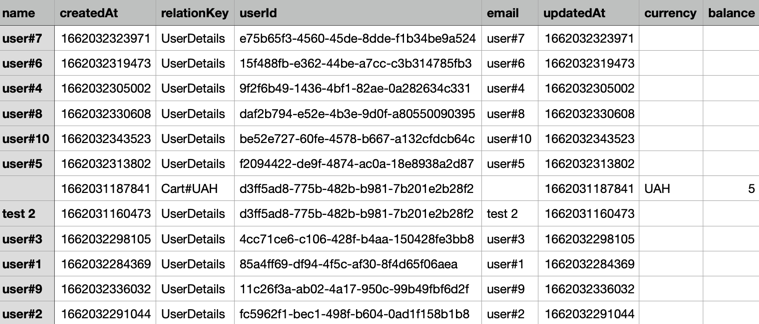

# nestjs-rest-api
NestJS Rest-Api powered by AWS DynamoDB

# Start
1. Create .env file in the root and copy & paste mocked data from .sample-env
2. Edit .env file by writing correct credentials and other connection data
3. Run `yarn start:dev` (`npm run start:dev`) for development or `yarn start` (`npm start`) to up the server
4. Connect to swagger using `http://localhost:3000/docs` url. Provide simple auth typing `secret` in `x-auth-key` input 
 

# Table schema at this project:

## `userId` is a hash key and `relationKey` is a range key

There is one entity called `User` that has nesting objects called `Carts`, in other words, `One User` to `Many Carts` (One-To-Many)